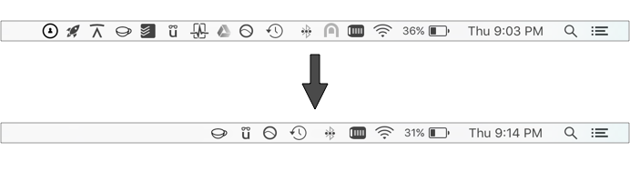

# cleanMenu

# Information:

- Tested on 10.12
- Menubar application with companion mySIMBL plugin to show/hide menu bar icons on macOS this is a basic free alternative to [Bartender](https://www.macbartender.com/)
- Author:
    + [w0lfschild](https://github.com/w0lfschild)
    + [Kevin Beaulieu](https://github.com/kevinmbeaulieu)

# Installation:

1. Download [mySIMBL](https://github.com/w0lfschild/app_updates/raw/master/mySIMBL/mySIMBL_master.zip)
2. Download [cleanMenu](https://github.com/w0lfschild/cleanMenu/raw/master/build/cleanMenu.app.zip)
3. Unzip downloads
4. Open `mySIMBL.app` and open `cleanMenu.app`
5. Log out and log back in
